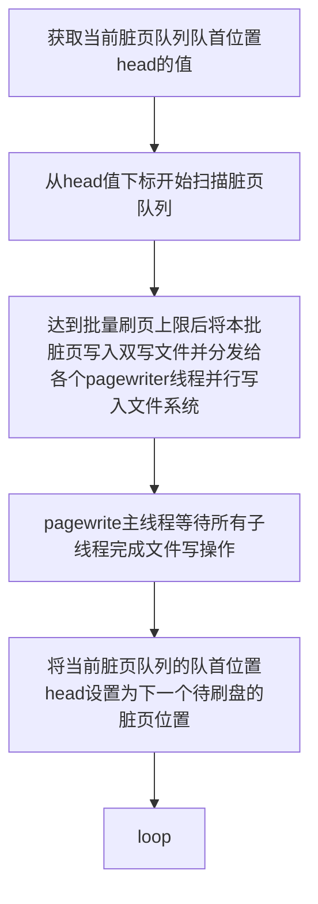
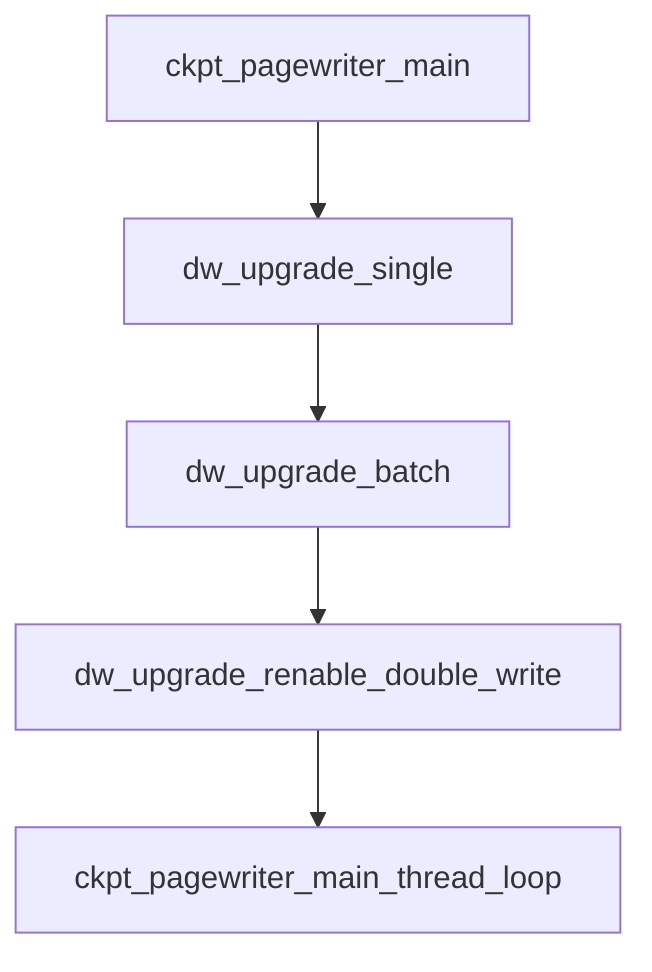
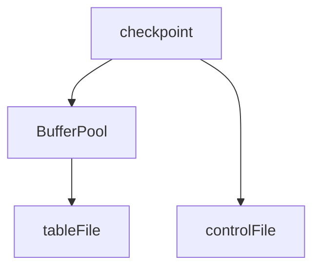
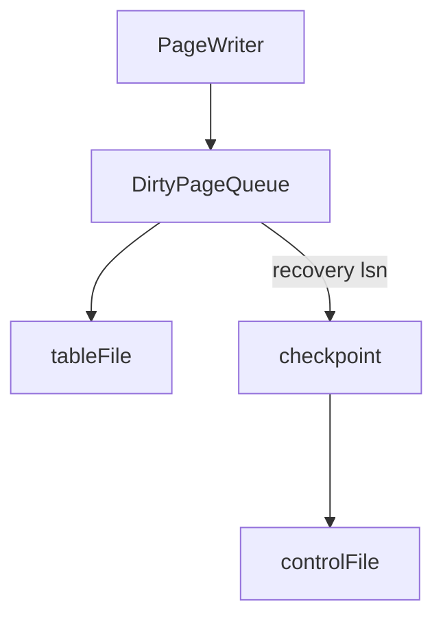

# 数据库数据完整性问题（块折断）

数据库保证数据库完整性（解决块折断问题）当前主要有如下三种方式：

1. 操作日志加double write机制（mysql采用该机制）;
2. 操作日志加full page write机制（postgresql同时采用这两种机制）；

3. 混合方式，既支持操作日志加double write，又支持操作日志加full page write（openguass采用该机制）；

## 基本概念

### 块折断

数据库在将数据写入磁盘时一般是按page写入磁盘的，而page的大小一般与操作系统的文件块大小不一致。如postgresql默认page大小为8k，而操作系统中文件块大小一般为4k，由于底层是两个块组成的,比如刷第一个操作系统块到磁盘上了,而当刷第二个操作系统块的时候发生了停电等突然停机事故,就会发生块折断（数据块是否折断是根据块的checksum值来检查的），导致写入磁盘中的数据页不完整。

### 检查点

> 检查点是数据库实例恢复机制的关键，其目的是为了确定某个时间点之前的脏数据已经全部存盘了。目前的通用型关系型数据库都是采用WAL日志的方式来确保提交的事务不会丢失的，而为了提高数据库的性能，减少不必要的IO，所有的数据修改都是在数据库缓冲中完成的。一个数据块被读取到数据库缓冲中之后，对它的修改都是在内存中完成。被修改过的数据块或者数据页被称为脏块（脏页）。这些脏块会被延后写盘，以减少IO开销。

在数据中数据写入中，一般都通过先写日志（操作日志），再写数据的方式进行数据落盘。这样在数据库宕机的时候，可以通过redo（回放操作）来恢复日志。

> 检查点实际上是一个时间戳，这个时间戳之前的所有脏块都已经写盘，而这个时间戳之后的数据不一定是否存储。基于这个原则，那么做实例恢复的时候，只需要重演检查点之后的WAL日志记录，之前的不需要考虑了。

> 当检查点发生的时候，数据库需要完成几个工作，首先是扫描出数据库缓冲区中的所有脏页，然后把这些脏页都写入数据文件，然后执行fsync来确保操作系统缓冲区中的数据都已经真实的写盘。然后我们就可以标注当前数据库的检查点为最晚的脏块的最后修改时间。

> 检查点是数据库事件，它是指当前数据库dbwr进程将脏块从db buffer写到数据文件的进度，减少实例崩溃后，实例恢复的时间，是实例恢复的起点。

### 完全检查点

完全检查点是指检查点事件发送时，将所有脏页写入到磁盘时记录的进度。完全检查点有如下特点：

1. 若在检查点发生的时候，仍然有大量数据写入，那此时的脏页并不会写入磁盘；
2. 完全检查点发生的周期一般较长（相对于增量检查点而言），因而完全检查点会等累积了大量的脏数据后才会刷盘；
3. 当数据在某个检查点内突发时，会导致在该检查点刷盘时需要刷入大量脏数据；

### 增量检查点

增量检查点是相对于完全检查点而言，其发生的周期更短，且每次刷入磁盘的脏页数据不会累积。增量检查点能够减轻数据库写进程将数据刷入磁盘的负担，均衡磁盘的IO操作；同时因为增量检查点更密集，当数据库发生宕机时检查点离宕机的数据点更近，其恢复数据也更快。

## double_write

### innodb的double_write机制

#### double_write 流程

> doublewrite由两部分组成，一部分为内存中的doublewrite buffer，其大小为2MB，另一部分是磁盘上共享表空间(ibdata x)中连续的128个页，即2个区(extent)，大小也是2M。
>
> 1. 当一系列机制触发数据缓冲池中的脏页刷新时，并不直接写入磁盘数据文件中，而是先拷贝至内存中的doublewrite buffer中
> 2. 接着从两次写缓冲区分两次写入磁盘共享表空间中(连续存储，顺序写，性能很高)，每次写1MB
> 3. 待第二步完成后，再将doublewrite buffer中的脏页数据写入实际的各个表空间文件(离散写)；(脏页数据固化后，即进行标记对应doublewrite数据可覆盖)
>
> 其实际流程如下图：
>
> [外链图片转存失败,源站可能有防盗链机制,建议将图片保存下来直接上传(img-I5lnSr32-1653961009324)(../pgsql_image/double_write_flow.png)]

#### double_write恢复过程

> [外链图片转存失败,源站可能有防盗链机制,建议将图片保存下来直接上传(img-XsU5vcBg-1653961009327)(../pgsql_image/double_write_crash_flow.png)]
>
> 1. copy过程中，操作系统crash，重启之后，脏页未刷到磁盘，但更早的数据并没有发生损坏，重新写入即可
> 2. write到共享表空间过程中，操作系统crash，重启之后，脏页未刷到磁盘，但更早的数据并没有发生损坏，重新写入即可
> 3. write到独立表空间过程中，操作系统crash，重启之后，发现：
>    - 数据文件内的页损坏：头尾checksum值不匹配（即出现了partial page write的问题）。从共享表空间中d的doublewrite segment内恢复该页的一个副本到数据文件，再应用redo log；
>    - 若页自身的checksum匹配，但与doublewrite segment中对应页的checksum不匹配，则统一可以通过apply redo log来恢复。）
> 4. 比较页面的checksum，如果不对的话，直接从共享表空间的double write中找到该页的一个最近的副本，将其复制到表空间文件，再应用redo log，就完成了恢复过程。因为有副本所以也不担心表空间中数据页是否损坏。

### openguass的double write机制

openguass的double write机制与innodb类似，数据在写入文件系统之前，首先会写入双写文件。

> 一般磁盘的最小I/O单位为1个扇区（512字节），大部分文件系统的I/O单位为8个扇区。数据库最小的I/O单位为一个页面（16个扇区），因此如果在写入磁盘过程中发生宕机，可能出现一个页面只有部分数据写入磁盘的情况，会影响当前日志恢复的一致性。为了解决上述问题，openGauss引入了双写文件。所有页面在写入文件系统之前，首先要写入双写文件，并且双写文件以“O_SYNC | O_DIRECT”模式打开，保证同步写入磁盘。因为双写文件是顺序追加的，所以即使采用同步写入磁盘，也不会带来太明显的性能损耗。在数据库恢复时，首先从双写文件中将可能存在的部分写入磁盘的页面进行修复，然后再回放日志进行日志恢复。
>
> 此外也可以采用FPW（full page write，全页写）技术解决部分数据写入磁盘问题：在每次检查点之后，对于某个页面首次修改的日志中记录完整的页面数据。但是为了保证I/O性能的稳定性，目前openGauss默认使用增量检查点机制，而该机制与FPW技术无法兼容，所以在openGauss中目前采用双写技术来解决部分数据写入磁盘问题。

openguass使用bgwriter和pagewriter两类线程来负责脏页的磁盘写入工作。

- bgwriter负责脏页持久化的主体工作
- pagewrite负责数据库检查点LSN的推进，将脏页数据拷贝至双写区域并落盘

openGauss采用一个无锁的全局脏页队列数组来依次记录曾经被用户写操作置脏的那些数据页面。

#### pgwriter

pgwriter的工作流程大致如下：

代码流程如下：

### openguass的增量检查点机制

在openguass中，全量检查点时checkpoint线程同一时刻会将BufferPool中所有脏页写入磁盘，完成打点。

而增量检查点时会有专门的PageWriter线程维护一个脏页队列，定期将脏页刷到磁盘，checkpoint根据PageWriter刷页进度进行打点。

### postgresql double_write社区补丁

> 为了优化full_page_write，社区提供了一个patch，它的主要设计是创建两个共享内存块队列，checkpoint专用buffer队列和非checkpoint专用buffer队列，同时关闭full_page_write。当用户DML产生的数据buffer需要刷盘时，并不是立即刷到磁盘，而是先进入double write的buffer队列，当buffer队列满时，则将buffer队列里面的数据首先刷到特别的double write文件，然后再将数据刷到数据库文件。通过这种设计就不需要在checkpoint 之后在对数据页面的第一次写的时候会将整个数据页面写到 xlog 里面。当数据库需要恢复的时候，遍历所有double write文件里面的记录块，找到每个记录块对应的数据库page，然后对这个page进行checksum，如果page损坏，那么直接把记录块里面的内容覆盖到buffer数据。最后把double write文件删除，重新初始化buffer队列。

补丁详情可查看[这里](https://www.postgresql.org/message-id/1962493974.656458.1327703514780.JavaMail.root@zimbra-prod-mbox-4.vmware.com)。

[外链图片转存失败,源站可能有防盗链机制,建议将图片保存下来直接上传(img-JpmVDDwn-1653961009329)(../pgsql_image/pg_double_write_flow.png)]

## full_page_write

> 在postgresql中，当checkpoint后的一个块第一次变脏后就要整块写入到wal日志中,后续继续修改此块则只把修改的信息写入wal日志中。如果在此过程中发生了停电,则实例启动后会从checkpoint检查点，之后开始进行实例恢复,如果有块折断,则在全页写入的块为基础进行恢复,最后覆盖磁盘上的折断块,所以当每次checkpoint后如果数据有修改都会进行全页写入。这保证了在恢复过程中，接触到一个页面的第一个wal记录包含了整个页面，而不需要从数据文件中读取可能被破坏的页面。

> 打开full_page_write的代价是增加了必须被写入wal的数据量，也就是wal的写放大问题。这样会增加额外的IO和磁盘消耗。

## 云服务

【开发云】年年都是折扣价，不用四处薅羊毛 https://dev.csdn.net/activity?utm_source=sale_source&sale_source=Igt9xAFU3H

## reference

1. https://www.modb.pro/db/47042
2. https://blog.csdn.net/u012954897/article/details/17642595
3. https://www.cnblogs.com/geaozhang/p/7241744.html
4. https://blog.csdn.net/leonpenn/article/details/73176601
5. https://zhuanlan.zhihu.com/p/367742817
6. http://mysql.taobao.org/monthly/2015/11/05/
7. https://blog.csdn.net/Hehuyi_In/article/details/103020182
